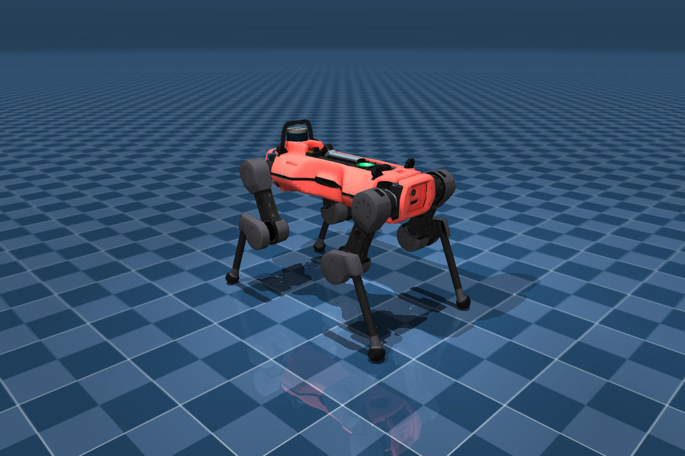

# ANYmal D Description (MJCF)

## Overview

This package contains a simplified robot description (MJCF) of the [ANYmal D
robot](https://www.anybotics.com/anymal) developed by
[ANYbotics](https://www.anybotics.com). It is derived from the publicly
available [`anymal_d_simple_description`](https://github.com/ANYbotics/anymal_d_simple_description)
URDF, and follows the same conventions as the ANYmal C MJCF in MuJoCo Menagerie
so the two are drop-in comparable.

<p float="left">
  
</p>

## URDF → MJCF derivation steps

1. Cloned the ANYmal D URDF + `.dae` meshes from ANYbotics.
2. Converted the `.dae` mesh files to `.obj` (preserving UVs) and converted the
   `.jpg` textures to `.png` using `trimesh` + `pycollada` + `Pillow`.
3. Removed the optional inspection-payload (pan/tilt sensor head) subtree to
   keep a clean quadruped, rewrote mesh paths, and added
   `<mujoco><compiler discardvisual="false"/></mujoco>` to the URDF.
4. Loaded the URDF into MuJoCo and saved a corresponding MJCF.
5. Added a `<freejoint/>` to the base and a tracking light.
6. Extracted common properties into the `<default>` section.
7. Added `<exclude>` clauses to prevent collisions between the base and thighs.
8. Added position-controlled actuators (kp=100, ±80 Nm), matching the URDF
   effort limits, plus joint damping/frictionloss and a small armature.
9. Softened the foot contacts to approximate rubber.
10. Declared textures/materials explicitly in the `<asset>` section.
11. Added a `home` keyframe (nominal standing pose) and an IMU site with
    orientation / gyro / accelerometer / velocimeter sensors.
12. Added `scene.xml`, which includes the robot with a textured groundplane,
    skybox, and haze.

## Joints / actuators

12 actuated joints (4 legs × HAA/HFE/KFE):
`LF_HAA LF_HFE LF_KFE  RF_HAA RF_HFE RF_KFE  LH_HAA LH_HFE LH_KFE  RH_HAA RH_HFE RH_KFE`.
Each has a matching position actuator of the same name.

## Usage

```python
import mujoco
model = mujoco.MjModel.from_xml_path("scene.xml")
data  = mujoco.MjData(model)
mujoco.mj_resetDataKeyframe(model, data, 0)   # 'home' standing pose
# data.ctrl[:] = desired 12 joint targets (rad)
mujoco.mj_step(model, data)
```

Or view interactively: `python -m mujoco.viewer --mjcf=scene.xml`

## License

The robot model is released under a [BSD-3-Clause License](LICENSE) (ANYbotics).
